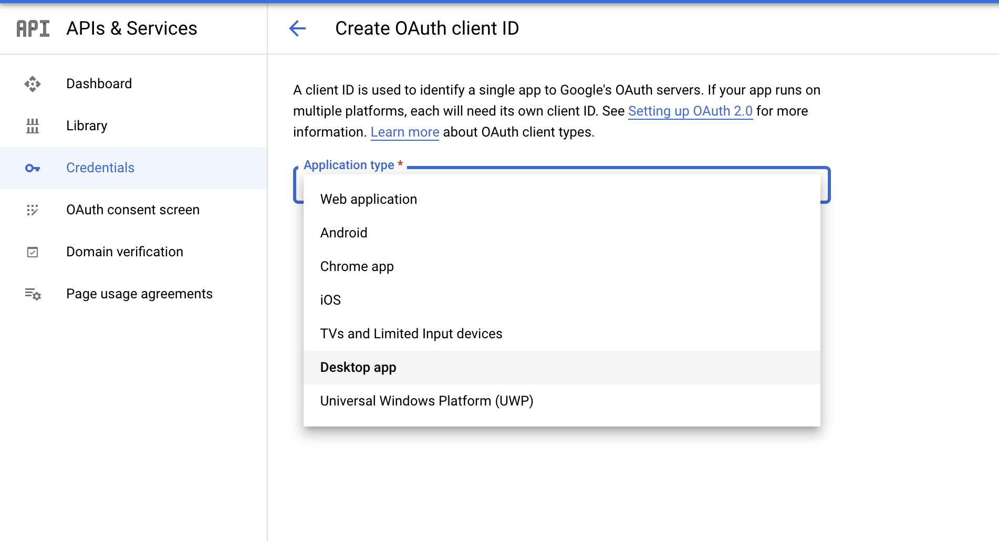
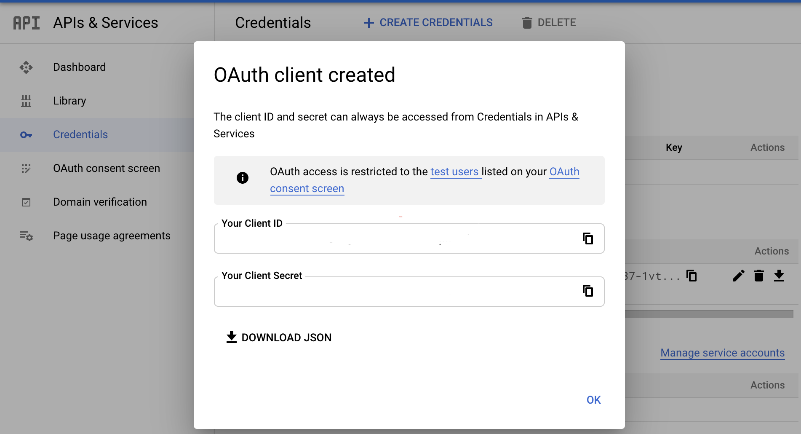

# GoogleGmailAPI
A project to read emails from Gmail using Gmail Oauth2.0 APIs. It can be used for Email Automation.

## Prerequisites
1. Enable Gmail API for your account - Refer to [link][1]
2. Create OAuth credentials for your project - Refer to [link][2]

Select Desktop App as the Application type for creating the credentials-

 

3. Download the credentials json file 

 

4. And place it in your src/test/resources folder

[1]:https://support.google.com/googleapi/answer/6158841?hl=en
[2]:https://developers.google.com/workspace/guides/create-credentials#create_a_oauth_client_id_credential

Refer to https://developers.google.com/gmail/api/quickstart/java for the code.

## Tests Execution

* After cloning the project, compile using the IDE Maven plugin or `mvn clean compile`
* Tests can be run by any of following ways:
    * Command line using `mvn clean test` from project root directory
    * Run (green play) button in Test class - `/src/test/java/com/github/emailautomation/test/EmailTest.java`
